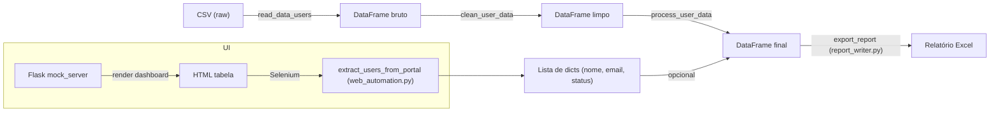

# SmartLicense RPA


Sistema de RPA (Robotic Process Automation) que audita licenças e acessos
de usuários corporativos, identifica contas inativas, projeta a economia
financeira ao revogar essas licenças e gera um relatório executivo em
Excel — como parte de um projeto de portfólio em Engenharia de Dados.

> Projeto simulado: os dados de usuários são gerados artificialmente
> (não é uma integração real com nenhum Admin Center), especificamente
> para praticar limpeza de dados, ETL e automação de ponta a ponta.

---

## Por que esse projeto existe

Empresas frequentemente pagam por licenças de software (Office 365,
Salesforce, VPN, etc.) atribuídas a colaboradores que pararam de usá‑las
há meses — contas inativas continuam custando dinheiro todo mês. Este
projeto simula uma rotina de auditoria que:

1. Lê os dados de usuários exportados de um “Admin Center”
2. Identifica quem está inativo com base na data do último login
3. Calcula quanto a empresa economizaria revogando essas licenças
4. Entrega isso em um relatório Excel pronto para decisão

## Status atual

| Etapa                              | Status |
|-----------------------------------|--------|
| Estrutura do projeto               | ✅ Concluído |
| Leitura de dados (CSV)             | ✅ Concluído |
| Limpeza de dados                   | ✅ Concluído |
| Processamento (status + economia)  | ✅ Concluído |
| Geração de relatório Excel          | ✅ Concluído |
| Automação de extração (Selenium)    | ✅ Concluído |
| Ambiente de teste Flask (mock_server) | ✅ Concluído |
| Envio de alerta por e‑mail          | ✅ Concluído |
| Agendamento automático              | ✅ Concluído |
| Testes automatizados (pytest)      | ✅ Concluído |

## Arquitetura

O pipeline segue um fluxo linear, onde cada etapa é uma função isolada,
testável independentemente, que recebe o resultado da etapa anterior:

```
data/raw/usuarios_admin_center.csv
        │
        ▼
   read_data_users()                → DataFrame bruto
        │
        ▼
   clean_user_data()                → nomes e‑mails corrigidos
        │
        ▼
   process_user_data()               → status (ativo/alerta/inativo) + economia
        │
        ▼
   export_report() (report_writer.py) → data/processed/relatorio_smartlicense.xlsx
```

### Estrutura de pastas

```
smartlicense-rpa/
├── data/
│   ├── raw/              # dados brutos
│   └── processed/        # relatórios Excel gerados
├── src/
│   ├── data_reader.py
│   ├── data_cleaner.py
│   ├── data_analysis.py
│   ├── report_writer.py
│   ├── email_notifier.py
│   └── web_automation.py
├── mock_server/
│   ├── app.py
│   └── templates/
├── logs/
│   ├── execution/
│   └── screenshots/
├── config/                # .env etc. (ignored)
├── tests/
│   ├── conftest.py
│   ├── test_data_analysis.py
│   ├── test_data_cleaner.py
│   ├── test_email_notifier.py
│   ├── test_pipeline_integration.py
│   └── test_report_writer.py
├── main.py
├── gerar_dados_simulados.py
├── requirements.txt
└── README.md
```

## Diagrama Mermaid (fluxo de dados completo)




---

## Decisões técnicas relevantes

- **Nenhuma coluna de status pronta no dado bruto** – a inatividade é calculada a partir da data do último login, reforçando a lógica de negócio.
- **Limpeza de e‑mail por reconstrução** – o e‑mail é gerado a partir do nome já limpo, garantindo consistência.
- **`np.select` para classificação** – permite vetorização e legibilidade ao definir múltiplas categorias.

## Histórico de alterações

- **Adicionar suporte a e‑mail**: módulo `src/email_notifier.py` com envio via SMTP local (aiosmtpd) e documentação.
- **Testes**: criado `tests/test_email_notifier.py`; todos os testes agora passam (9 testes, 0 falhas).
- **Agendamento**: implementação de `iniciar_agendamento()` em `main.py` (2 minutos para demonstração).
- **Dependências**: restaurado `numpy==2.1.0`; mantido `pytest>=8.0`.
- **Limpeza de histórico**: removido o arquivo `AGENTS.md` do repositório e eliminado o rastreamento de `__pycache__`.
- **Configuração**: pasta `config/` marcada para ser ignorada no `.gitignore` e removida do rastreamento.


- Automatizar a extração de dados simulando login em um sistema via Selenium.
- Enviar o relatório por e‑mail automaticamente (`smtplib`).
- Agendar execuções recorrentes com a biblioteca `schedule`.
- Cobrir o pipeline com testes automatizados (`pytest`).

## Autor

**James Gustavo de Castro Fernandes**
Projeto desenvolvido como parte de estudos em Engenharia de Dados.
