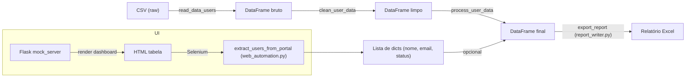

# SmartLicense RPA


> **SmartLicense RPA** é um conjunto de scripts Python‑14 que automatiza a auditoria de licenças corporativas. O fluxo completo inclui:
>
> 1. **Leitura** do CSV exportado do (simulado) Admin Center.  
> 2. **Limpeza** de nomes e reconstrução de e‑mails (remoção de títulos, normalização de acentos).  
> 3. **Classificação** de usuários em *ativo*, *alerta* ou *inativo* a partir da data do último login, com cálculo da economia anual para contas inativas.  
> 4. **Geração** de um relatório Excel contendo duas abas (“Resumo” e “Detalhes”).  
> 5. **Envio automático** do relatório por e‑mail via um servidor SMTP local de teste (aiosmtpd).  
> 6. **Agendamento** da execução completa (exemplo: a cada 2 minutos para demonstração, facilmente configurável para execução diária).  
> 7. **Visualização** dos resultados em um mock server Flask com páginas de login e dashboard.  
> 8. **Cobertura de testes** completa (9 testes + integração) usando pytest, garantindo que cada componente funcione isoladamente e em conjunto.  
>
> Tudo isso está organizado como um projeto de portfólio em **Engenharia de Dados**, pronto para ser expandido (por exemplo, integrando um servidor SMTP real, ajustando o agendamento para cron diário ou adicionando novos conectores de fonte de dados).

---

## Por que esse projeto existe

Empresas frequentemente pagam por licenças de software (Office 365,
Salesforce, VPN, etc.) atribuídas a colaboradores que pararam de usá‑las
há meses — contas inativas continuam custando dinheiro todo mês. Este
projeto simula uma rotina de auditoria que:

1. Lê os dados de usuários exportados de um “Admin Center”
2. Identifica quem está inativo com base na data do último login
3. Calcula quanto a empresa economizaria revogando essas licenças
4. Entrega isso em um relatório Excel pronto para decisão

## Status atual

| Etapa                              | Status |
|-----------------------------------|--------|
| Estrutura do projeto               | ✅ Concluído |
| Leitura de dados (CSV)             | ✅ Concluído |
| Limpeza de dados                   | ✅ Concluído |
| Processamento (status + economia)  | ✅ Concluído |
| Geração de relatório Excel          | ✅ Concluído |
| Automação de extração (Selenium)    | ✅ Concluído |
| Ambiente de teste Flask (mock_server) | ✅ Concluído |
| Envio de alerta por e‑mail          | ✅ Concluído |
| Agendamento automático              | ✅ Concluído |
| Testes automatizados (pytest)      | ✅ Concluído |

## Arquitetura

O pipeline segue um fluxo linear, onde cada etapa é uma função isolada,
testável independentemente, que recebe o resultado da etapa anterior:

```
data/raw/usuarios_admin_center.csv
        │
        ▼
read_data_users()                     → DataFrame bruto
        │
        ▼
clean_user_data()                     → nomes e‑mails corrigidos
        │
        ▼
process_user_data()                    → status (ativo/alerta/inativo) + economia
        │
        ▼
export_report() (report_writer.py)    → data/processed/relatorio_smartlicense.xlsx
        │
        ├─► send_alert_email() (email_notifier.py) → e‑mail com anexo (opcional)
        ├─► iniciar_agendamento() (schedule)        → execução periódica (ex.: a cada 2 min)
        └─► logging (logs/)                         → arquivo de log por execução
```

### Estrutura de pastas

```
smartlicense-rpa/
├── data/
│   ├── raw/              # dados brutos
│   └── processed/        # relatórios Excel gerados
├── src/
│   ├── data_reader.py
│   ├── data_cleaner.py
│   ├── data_analysis.py
│   ├── report_writer.py
│   ├── email_notifier.py
│   └── web_automation.py
├── mock_server/
│   ├── app.py
│   └── templates/
├── logs/
│   ├── execution/
├── tests/
│   ├── conftest.py
│   ├── test_data_analysis.py
│   ├── test_data_cleaner.py
│   ├── test_email_notifier.py
│   ├── test_pipeline_integration.py
│   └── test_report_writer.py
├── main.py
├── gerar_dados_simulados.py
├── requirements.txt
└── README.md
```

## Diagrama Mermaid (fluxo de dados completo)



## Logging da Execução

A cada execução do pipeline (via `run()` ou agendamento) é criado um arquivo de log em **logs/execution/**, no formato `execucao_YYYYMMDD_HHMMSS.log`. Cada linha contém timestamp, nível e mensagem, por exemplo:

```
2026-09-24 13:40:10,893 - INFO - Iniciando execução do pipeline SmartLicense RPA.
2026-09-24 13:40:10,934 - INFO - 500 usuários lidos do arquivo CSV.
2026-09-24 13:40:10,968 - INFO - Status: 335 ativos, 104 em alerta, 61 inativos.
2026-09-24 13:40:10,968 - INFO - Economia anual potencial: R$ 26826.00
2026-09-24 13:40:11,360 - INFO - Relatório gerado com sucesso em: data/processed/relatorio_smartlicense.xlsx
```

- **Info**: início da execução, contagem de usuários, resumo de status, economia total e confirmação de geração do relatório.
- **Error**: exceções registradas com stack‑trace (`logger.error(..., exc_info=True)`).
- O logger também envia as mensagens ao console (StreamHandler), permitindo acompanhamento em tempo real.


---

## Decisões técnicas relevantes

- **Nenhuma coluna de status pronta no dado bruto** – a inatividade é calculada a partir da data do último login, reforçando a lógica de negócio.

- **`np.select` para classificação** – permite vetorização e legibilidade ao definir múltiplas categorias.

## Histórico de alterações

- **Adicionar suporte a e‑mail**: módulo `src/email_notifier.py` com envio via SMTP local (aiosmtpd) e documentação.
- **Testes**: criado `tests/test_email_notifier.py`; todos os testes agora passam (9 testes, 0 falhas).
- Implementado logging estruturado por execução (arquivo em logs/execution/ com timestamp), substituindo prints por `logger.info`/`logger.error` e adicionando handlers de arquivo e console.
- **Configuração**: pasta `config/` marcada para ser ignorada no `.gitignore` e removida do rastreamento.


## Autor

**James Gustavo de Castro Fernandes**
Projeto desenvolvido como parte de estudos em Engenharia de Dados.